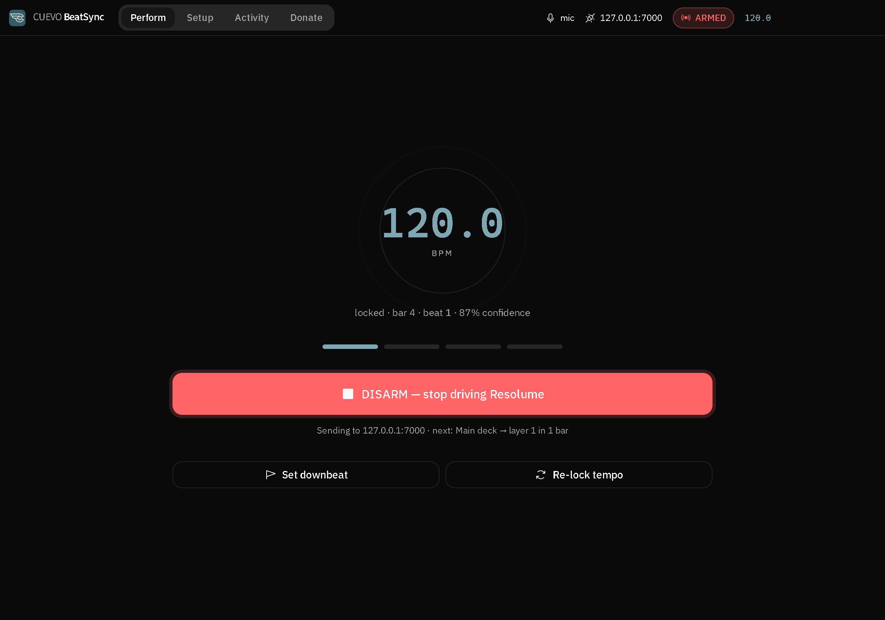
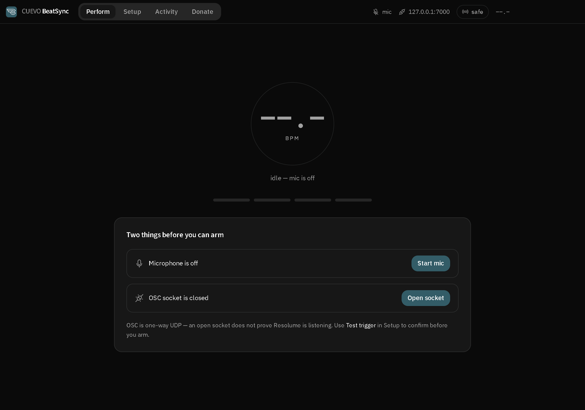
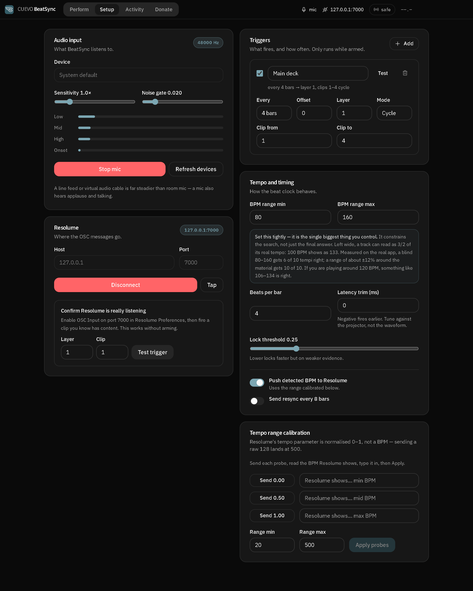
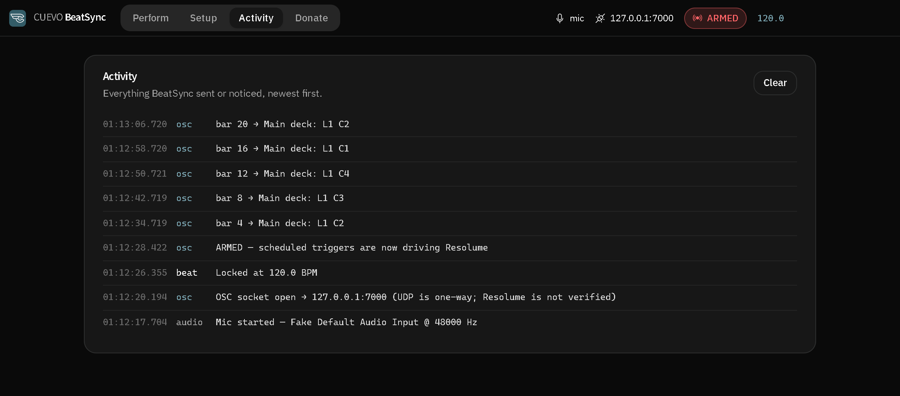

# CUEVO BeatSync

Auto beat-sync controller for Resolume Arena. It listens to the music, works out
the tempo, and fires your clips on the beat over OSC — so you stop tapping the
tempo bar halfway through a set.

Electron + Svelte 5 + Tailwind v4. Windows is the tested platform. No runtime
dependencies, no account, nothing phones home.

The important thing to understand before anything else: **BeatSync never
triggers on a beat it heard.** By the time a kick has been analysed, sent over
IPC, pushed through UDP and rendered by Resolume, the beat is gone. Instead it
locks a tempo, predicts where the next beat will be, and schedules the OSC
message ~120 ms *early* so it lands on time.



*Locked at 120, four bars in, armed. Everything you need mid-set is on this one
screen — and the app tells you what fires next before it fires.*

---

## Install

**Just want to use it** — grab the installer from
[Releases](../../releases) and run it. Windows only for now.

**From source:**

```bash
git clone <this-repo>
cd beatsync
npm install
```

Two terminals to run it in dev:

```bash
npm run dev:renderer   # Terminal 1 — Vite on port 5174
npm run dev            # Terminal 2 — the Electron window
```

To build your own installer:

```bash
npm run build          # NSIS installer lands in dist/
```

You need Node 18+ and a working microphone or audio input. Resolume Arena 7 is
what the clip addresses are confirmed against.

---

## Getting started

Fifteen minutes the first time, thirty seconds every time after — settings are
saved, except for arming, which never is.



*A cold start. Rather than greying out the ARM button and leaving you to guess,
it names the two things standing in the way and fixes each in one click.*

### 1. Let Resolume listen

In Resolume: **Preferences → OSC** → tick **OSC Input**, port `7000`.

This is the step people forget, and nothing downstream will tell you that you
forgot it. OSC is one-way UDP: BeatSync can send perfectly into a void and have
no idea.

### 2. Open the socket

BeatSync → **Setup → Resolume**. Leave host at `127.0.0.1` and port at `7000` if
Resolume is on the same machine; otherwise put in the other machine's IP. Hit
**Open OSC socket**.

The badge now reads `127.0.0.1:7000`. That means the socket opened — it does
*not* mean Resolume is listening. Which is why the next step exists.

### 3. Prove it actually arrived

Same panel, bottom box. Put in a layer and clip number you *know* has content in
it, and press **Test trigger**.

The clip should fire in Resolume. If it doesn't, stop here and fix it — OSC
Input is off, the port is wrong, or you're pointed at the wrong machine. Nothing
else in this app will work until a test trigger fires.

Test trigger works whether or not you're armed, so you can check this mid-set
without BeatSync taking over.

### 4. Feed it audio



*The whole Setup tab. Everything here is configured once and remembered.*

**Setup → Audio**. Pick your input, press **Start mic**.

Play music and watch the four meters. **Low / Mid / High** should move with the
track; **Onset** should spike on hits, not sit pinned or flat. If Onset never
moves, raise **Sensitivity**. If it never drops back to zero during silence,
raise the **Noise gate**.

> A line feed or a virtual audio cable beats a room mic by a wide margin. A mic
> in a room also hears the crowd, the MC, and someone's conversation near the
> booth — all of which look like onsets.

### 5. Tell it roughly what tempo to expect

**Setup → Tempo and timing → BPM range.** This matters more than anything else
on that card.

Blind, on the default 80–160 range, tempo detection gets 6 out of 10 right.
Narrowed to around ±12% of the actual material, it gets 10 out of 10. Both
numbers are measured (`npm run test:accuracy`), not estimated.

Starting points:

| Material | Range |
|---|---|
| House, techno, disco | 110–140 |
| Hip-hop, trap, RnB | 70–105 |
| Drum & bass, jungle | 150–185 |
| Mixed / you don't know | 80–160, and expect mistakes |

The range is a genuine search constraint, not a tidy-up applied at the end. Set
it and everything else gets easier.

### 6. Lock on

Go to the **Perform** tab. Play the track and watch the BPM readout. It goes
teal when locked.

It takes a few seconds on purpose. The clock waits for two estimates in a row to
agree before it commits, and three before it accepts a big tempo jump. Without
that it would lock onto the first reading off a half-filled buffer — usually a
metrical relative of the real tempo — and then politely smooth around the wrong
answer forever.

If it locks onto something wrong, press **Relock** and let it try again. If it
consistently reads exactly 1.5× or 0.75× the real tempo, your BPM range is the
problem, not the detector.

### 7. Line up the bar

Press **Set downbeat** on a "1" — the actual downbeat you'd count to.

BeatSync knows where the beats are, but it can't know which one you think is the
start of the bar. This is how you tell it. Your triggers all count bars from
here, so if this is off by one, everything fires on the wrong beat.

### 8. Set up what fires

**Setup → Triggers.** Each trigger is one rule, and the grey line under the name
restates it in English so you don't have to read four fields to know what it
does.

| Field | What it does |
|---|---|
| **Every** | Fire every N bars. |
| **Offset** | Shift the pattern. `every 8, offset 4` fires on bars 4, 12, 20… |
| **Layer** | Resolume layer, 1–8. |
| **Mode** | `Fixed` — always the same clip. `Cycle` — walk the range in order. `Random` — pick from the range. |

Triggers only fire on downbeats, and only while armed.

A layout that works for most sets: one trigger every 8 bars cycling a range of
four background clips, plus one every 16 bars on an overlay layer. Start small —
two triggers you understand beat six you don't.

**Test** on each trigger fires its clip immediately, so you can check you've got
the right layer before you go anywhere near the ARM button.

### 9. Arm it

Back to **Perform**, press **ARM**.

Until now BeatSync has sent nothing automatic — no triggers, no tempo, no
resync. The header says `safe`. After ARM it says `armed` and shows the target
plus what fires next and how many bars away.

Press it again to stop. It also disarms itself if the mic stops or the socket
closes, and it never starts up armed — you will always arm deliberately.

---

## Pushing tempo to Resolume

**This one is on by default, and you should turn it off until you've calibrated
it** — Setup → Tempo and timing → *Push detected BPM to Resolume*. It only sends
while armed, so nothing happens before then, but here's the trap.

Resolume's tempo OSC parameter is a **normalised 0–1 value, not a BPM**. Send it
a raw `100` and it clamps to `1.0`, which shows up in Arena as 500 BPM. BeatSync
converts for you using the range in **Setup → Tempo range calibration**, but the
20–500 default is an assumption about your Arena build, not a fact.

Calibrate it:

1. Press **Send 0.00**, read the BPM Arena shows, type it in.
2. Same for **Send 0.50** and **Send 1.00**.
3. **Apply.**

If the 0.50 probe doesn't land near the midpoint of the other two, the mapping
isn't linear on your build. Leave tempo push off and drive Resolume with clip
triggers instead — they're confirmed and they're the thing you actually came
for.

---

## The rest of Tempo and timing

| Control | Use it when |
|---|---|
| **Beats per bar** | Not in 4/4. Drives the bar counter your triggers run on. |
| **Latency trim (ms)** | Clips land visibly late or early. Negative fires earlier. Tune by eye against the projector, not by looking at a waveform. |
| **Lock threshold** | Lower locks faster on weaker evidence; raise it if it keeps locking onto rubbish. |
| **Send resync every 8 bars** | You want Resolume's own clock nudged back into line periodically. Unverified across Arena versions — test it. |

---

## When something's wrong

| What you see | What it usually is |
|---|---|
| Test trigger does nothing | OSC Input off in Resolume, wrong port, or wrong IP. Nothing else works until this does. |
| BPM never locks | Onset meter flat → raise Sensitivity. Onset pinned high → raise Noise gate. Still nothing → the mic isn't hearing music. |
| BPM reads ~1.5× or 0.75× the real tempo | BPM range too wide. Narrow it around the actual material. |
| Locked, armed, but clips fire on the wrong beat | Press **Set downbeat** on a real "1". |
| Clips land visibly late | Latency trim, more negative. |
| *"frame loop stalled — sync paused"* | Chromium throttled the window. Shouldn't happen — it's explicitly disabled — but if it does, the app tells you instead of drifting silently. |
| *"Saved input device is gone"* | Interface unplugged or moved to another USB port. It fell back to the default; re-pick your device. |
| Mic won't start at all | Windows Settings → Privacy → Microphone. Or another app has exclusive use of the device. |
| Arena shows 500 BPM | Tempo push without calibration. See above. |

The **Activity** tab logs the last 200 events with millisecond stamps — mic,
OSC, beat and errors. When something goes wrong mid-set, that's where it is.



*A trigger in cycle mode, doing exactly what it was told: every 4 bars, layer 1,
walking clips 1–4. Eight seconds apart at 120 BPM.*

---

## How it works

```
mic → AnalyserNode FFT (2048)
    → half-wave rectified spectral flux, per band, on a fixed 10ms grid
    → autocorrelation proposes candidate periods
    → comb filter picks the real one (rejects the classic 1.5x error)
    → phase fitted with the fractional period over the last ~3s
    → PLL-style beat clock extrapolates forward
    → OSC scheduled ~120ms early → UDP :7000 → Resolume
```

Two details in there that took real work.

The comb filter used to score whole-bin periods, so 96 BPM — 62.5 bins — got
judged on a 63-bin pulse train that walked off the beat within a few bars,
handing the win to a wrong tempo that happened to land near a whole number.

And spectral flux used to be summed across the whole spectrum, which lets
bandwidth stand in for loudness: a kick fills a handful of low bins while a
hi-hat smears across hundreds, so off-beat hats read louder than the beat
itself. Per-band flux fixes that.

Things that were tried and **measured and rejected**, so nobody repeats them: a
log-normal tempo prior (strong enough to fix 128 BPM broke 174), heavier
weighting of the kick band, detrending the onset envelope, and robust comb
statistics — minimum, geometric mean and trimmed mean each beat the plain
average on the patterns they were tuned against, and lost on unseen tempi.

### Running behind Resolume

During a show this window sits behind everything else. Chromium stops
`requestAnimationFrame` and clamps timers in a backgrounded or minimised window,
which would kill beat detection outright. BeatSync turns that off
(`backgroundThrottling: false` plus three Chromium switches in
[src/main/index.cjs](src/main/index.cjs)).

Measured with `npm run test:background`:

| | foreground | minimised |
|---|---|---|
| Electron defaults | 60.5 fps | **0.0 fps** |
| BeatSync settings | 60.0 fps | **60.0 fps** |

If frames ever do stop anyway, the header says *frame loop stalled — sync
paused* rather than letting the beat clock drift and lie to you.

---

## Arming, and why it's a whole feature

Opening the socket doesn't start driving the show. Nothing automatic goes out
until you press ARM, and arming is deliberately not persisted, so the app can
never start up already sending into a venue.

`npm run test:e2e` holds the app connected and tempo-locked for six bars and
asserts that **zero** UDP datagrams leave, then that arming starts them and
disarming stops them again.

---

## Honest limitations

- **OSC is one-way UDP.** Opening the socket proves nothing about Resolume
  listening. "Socket open" in the UI means exactly that. A clip firing is the
  only real confirmation.
- **A mic hears the room** — applause, speech, the crowd. Line-in is far more
  stable.
- **Octave ambiguity is a choice, not a solve.** 174 BPM inside an 80–160 range
  is reported as 87. Set the range to match the material.
- **Accuracy numbers come from click tracks and synthetic drum patterns.** Over
  72 offline cases (4 patterns × 18 tempi, `npm run test:flux`): 58/72 blind,
  70/72 at ±15%, 72/72 at ±10%. A real room is harder than a click track, so
  live accuracy is unverified even for the tempi that pass here.
- **Clip connect addresses** (`/composition/layers/N/clips/M/connect`) are
  confirmed for Arena 7. The tempo controller addresses
  (`/composition/tempocontroller/tempo`, `/resync`, `/tempotap`) are less
  certain across versions — verify before relying on them in a show.
- **The tempo parameter is normalised 0–1, not a BPM** (see calibration above).
- **The first lock is slower than it could be, on purpose.** Two agreeing
  estimates before locking, three before accepting a jump. Locking faster means
  locking wrong and staying wrong.
- Windows is the only platform actually tested.

---

## Interface notes

Two screens do the work, because there are really only two jobs. **Perform** is
what stays up during a set: the tempo, where you are in the bar, and one button
that decides whether BeatSync is driving Resolume. Until you can arm, it says
exactly what's missing and fixes it in one click. **Setup** holds everything
configured once. **Activity** is the log, and **Donate** is there if this saved
you an evening.

Status — mic, OSC target, armed, BPM — lives in the header rather than on a
tab, so it's readable no matter which screen you left open.

Built on the shadcn preset `b7PaZO816h` (style Vega, base Neutral, radius Large,
Source Sans 3 + IBM Plex Sans, Phosphor icons), rebuilt as Svelte 5 components
rather than pulled in from React. Fonts are bundled rather than fetched from
Google, so the app looks right in a venue with no internet.

The system title bar is hidden and the app's own header takes its place, VS Code
style. The min/max/close buttons stay **native** through Electron's
`titleBarOverlay` rather than being redrawn in HTML — that keeps Windows 11 Snap
Layouts and correct close-button behaviour, which custom buttons lose. The
header lays itself out inside `env(titlebar-area-*)`, so it never collides with
those buttons at any window size or DPI.

The brand colour `#335C67` measures 7.32:1 under white as a fill, but only
2.70:1 as text on this background — under even the 3.0 large-text floor. So
`--primary` fills buttons and the logo mark, and `--primary-bright` (`#7ca7b3`,
same hue, 7.53:1) carries everything thin or text-shaped: the BPM readout, beat
markers, meters, status text. Setting type in `--primary` would make the tempo
unreadable across a dark room.

Dark only, deliberately. A booth is dark, and a light theme flashing up mid-set
is a hazard, not a feature.

---

## Tests

```bash
npm test                  # headless: tempo estimator + OSC encoder
npm run test:e2e          # drives the real UI with a synthetic click track through a
                          # fake mic: mic restart + arm gating (needs Vite running)
npm run test:accuracy     # tempo accuracy through the whole audio path
                          #   --band 0.12 models an operator-set BPM range
npm run test:flux         # same, offline over synthetic drum patterns — seconds, not minutes
npm run test:background   # proves rAF keeps running while minimised
```

`BEATSYNC_DEVTOOLS=1` opens DevTools on launch.

The screenshots above aren't hand-cropped — they're captured from the real app
by the same CDP harness the e2e test uses, fed the same synthetic click track.
Regenerate them after a UI change instead of letting them go stale:

```bash
npm run dev:renderer      # in one terminal
npm run screenshots       # writes docs/*.png
```

---

## Layout

```
src/
  main/
    index.cjs        Electron main: window, permissions, IPC handlers
    osc.cjs          UDP socket + Resolume message helpers
    oscMessage.cjs   OSC 1.0 encoder (float / int / string)
  preload.cjs        contextBridge -> window.api
  renderer/
    lib/
      tempo.js       Flux grid, autocorrelation, comb filter, phase fitting
      beatClock.js   PLL + predictive scheduler
      audioEngine.js Mic capture, FFT, spectral flux, band energies
      controller.svelte.js  Wires audio + clock + triggers + OSC
      store.svelte.js       Persisted settings and live runtime state
    components/      Svelte 5 UI
scripts/
  test-tempo.mjs      Tempo estimator against synthetic onset signals
  test-osc.mjs        OSC encode/decode round-trip over UDP loopback
  test-e2e.mjs        Mic restart regression, driven over CDP with a fake mic
  test-arm.mjs        Proves nothing is sent until ARM is pressed
  test-accuracy.mjs   Tempo accuracy through the whole audio path
  test-flux.mjs       The same, offline and far faster, over drum patterns
  test-background.cjs Measures rAF survival in a minimised window
  lib/offline-analyser.mjs  FFT + WAV decode, an offline stand-in for AnalyserNode
  lib/flux.mjs        Onset extraction, mirroring the renderer's
  lib/patterns.mjs    Synthetic kick/snare/hat patterns to measure against
  cdp.mjs             Shared DevTools-protocol driver for the UI tests
  osc-decode.mjs      Independent OSC decoder used by the tests
  make-clicktrack.mjs Generates the WAV click track used by the e2e test
  screenshots.mjs     Captures the README images from the running app over CDP
  recolor-icon.py     Rebuilds icon/app-icon.* in the brand colour
  dev-electron.mjs    Launcher that strips ELECTRON_RUN_AS_NODE
```

[SRS.md](SRS.md) has the full requirements spec if you're working on the code.
